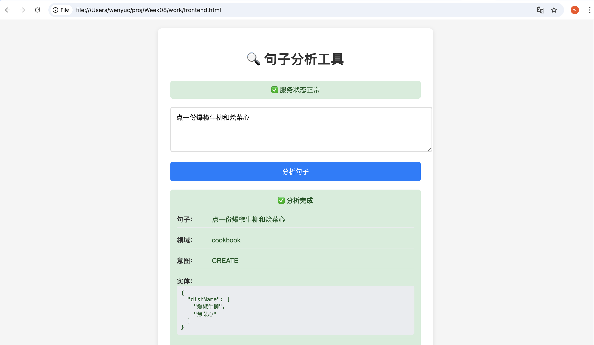
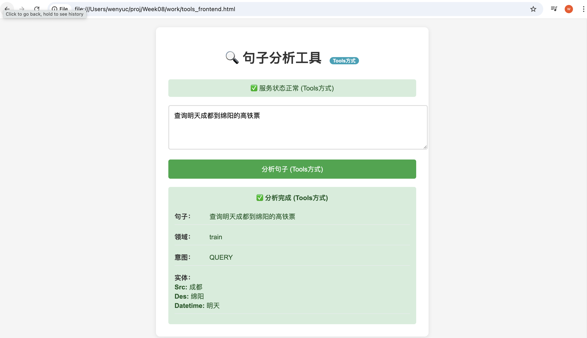
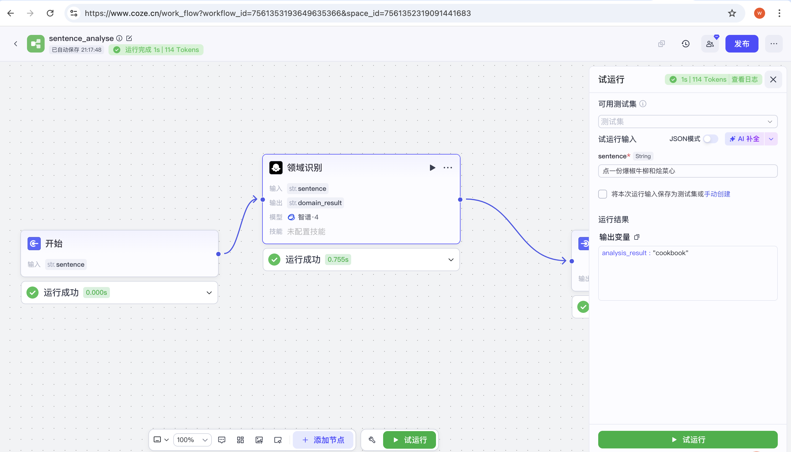

[TOC]

## 1. Task2: 通过LLM prompt engineering进行领域/意图/字段识别

### 代码
task2_prompt.py

### 数据集
sentences.txt

### 使用
(langchain_venv) 192:work wenyuc$ cd task2
(langchain_venv) 192:work wenyuc$ python task2_prompt.py
请查询一下成都到绵阳的汽车票，明天的
对于您提供的查询文本，以下是领域类别、意图类型和实体标签的提取结果：

```json
{
    "domain": "bus",
    "intent": "QUERY",
    "slots": {
        "startLoc_city": "成都",
        "Dest": "绵阳",
        "datetime_date": "明天"
    }
}
```

## 2. Task2: 通过LLM tools进行领域/意图/字段识别
### 代码
task2_tools.py

### 数据集
sentences.txt

### 使用
(langchain_venv) 192:work wenyuc$ cd task3
(langchain_venv) 192:work wenyuc$ python task2_tools.py
分析句子: 点一份爆椒牛柳和一份烩菜心
调试 - 完整返回: ChatCompletion(id='20251015220846c64e14fe8a764298', choices=[Choice(finish_reason='tool_calls', index=0, logprobs=None, message=ChatCompletionMessage(content=None, refusal=None, role='assistant', annotations=None, audio=None, function_call=None, tool_calls=[ChatCompletionMessageFunctionToolCall(id='call_-8253057730721134803', function=Function(arguments='{"domain":"cooking","intent":"ORDER","DishName":"爆椒牛柳,烩菜心"}', name='IntentDomainNerTask'), type='function', index=0)]))], created=1760537328, model='glm-4', object=None, service_tier=None, system_fingerprint=None, usage=CompletionUsage(completion_tokens=35, prompt_tokens=843, total_tokens=878, completion_tokens_details=None, prompt_tokens_details=None), request_id='20251015220846c64e14fe8a764298')
调试 - 原始返回: {"domain":"cooking","intent":"ORDER","DishName":"爆椒牛柳,烩菜心"}
分析结果:
  领域: cooking
  意图: ORDER
  菜名列表: 爆椒牛柳,烩菜心
--------------------------------------------------

## 3. Task3: 通过LLM prompt engineering进行领域/意图/字段识别 + FastAPI

### 代码：
prompt_backend.py
prompt_frontend.py
prompt_frontend.html

### 启动服务
(langchain_venv) 192:work wenyuc$ cd task3
(langchain_venv) 192:work wenyuc$ python prompt_backend.py
        
  @app.on_event("startup")
INFO:     Started server process [33247]
INFO:     Waiting for application startup.
INFO:     Application startup complete.

(langchain_venv) 192:work wenyuc$python prompt_frontend.py

### 测试

1. curl测试
(langchain_venv) MacBookPro:work wenyuc$ curl -X POST "http://localhost:8000/analyze" \
> -H "Content-Type: application/json" \
> -d '{"sentence": "三分钟后播放李克勤的红日"}'
{"sentence":"三分钟后播放李克勤的红日","domain":"music","intent":"PLAY","slots":{"artist":"李克勤","song":"红日","startDate_time":"三分钟后"}}
(langchain_venv) MacBookPro:work wenyuc$ 

2. 命令行前端测试
(langchain_venv) MacBookPro:work wenyuc$ python prompt_frontend.py

🔍 句子分析工具
========================================
✅ 服务状态正常，可以开始分析句子
💡 输入 'quit' 或 'exit' 退出程序
----------------------------------------

请输入要分析的句子: 导航到四川大学望江校区东门
分析中...

📊 分析结果:
   句子: 导航到四川大学望江校区东门
   领域: map
   意图: ROUTE
   实体: {
    "location_poi": "四川大学望江校区东门"
}

请输入要分析的句子: 

3. 浏览器测试服务状态
在浏览器中输入地址http://127.0.0.1:8000/health
返回
{"status":"healthy","client_initialized":true}

4. 浏览器页面功能测试


## 4. Task3: 通过LLM tools进行领域/意图/字段识别 + FastAPI

### 代码：
tools_backend.py
tools_frontend.py
tools_frontend.html

### 启动服务
(langchain_venv) 192:work wenyuc$ cd task3
(langchain_venv) 192:work wenyuc$ python tools_backend.py
        
  @app.on_event("startup")
INFO:     Started server process [33792]
INFO:     Waiting for application startup.
✅ ExtractionAgent客户端初始化成功
INFO:     Application startup complete.
INFO:     Uvicorn running on http://0.0.0.0:8008 (Press CTRL+C to quit)

(langchain_venv) 192:work wenyuc$python prompt_frontend.py

### 测试

1. curl测试
(langchain_venv) MacBookPro:work wenyuc$ curl -X POST "http://localhost:8008/analyze" -H "Content-Type: application/json" -d '{"sentence": "导航
到四川大学望江校区东门"}'
{"sentence":"导航到四川大学望江校区东门","domain":"navigation","intent":"NAVIGATION","slots":{"Location":"四川大学望江校区东门"}}
(langchain_venv) MacBookPro:work wenyuc$

1. 浏览器测试服务状态
在浏览器中输入地址http://127.0.0.1:8008/health
返回
{"status":"healthy","client_initialized":true，"method":"tools"}

2. 浏览器页面功能测试


## 5. Coze workflow
