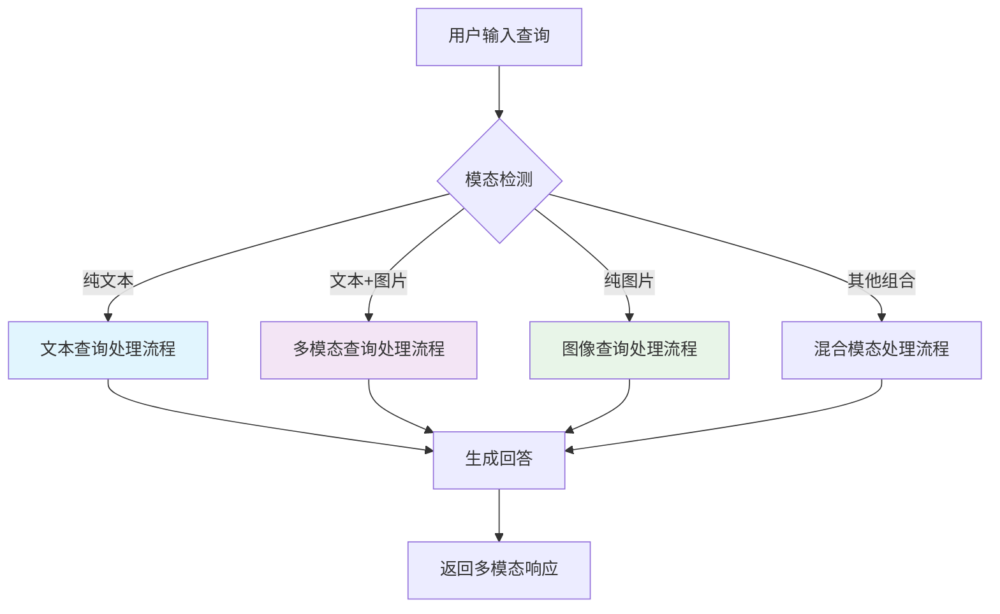
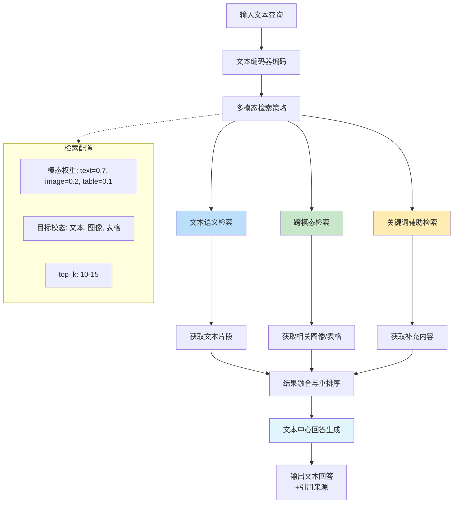
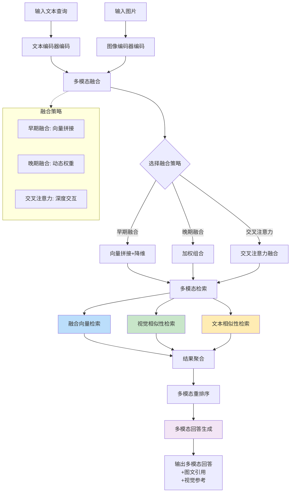
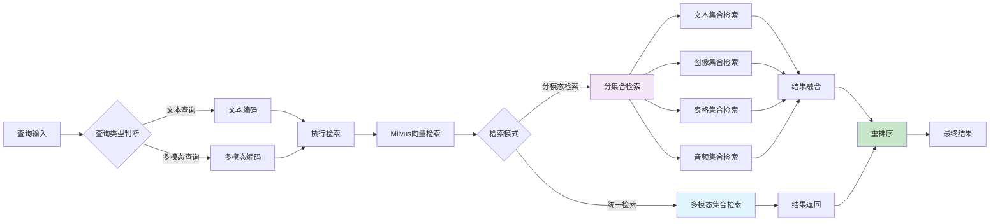
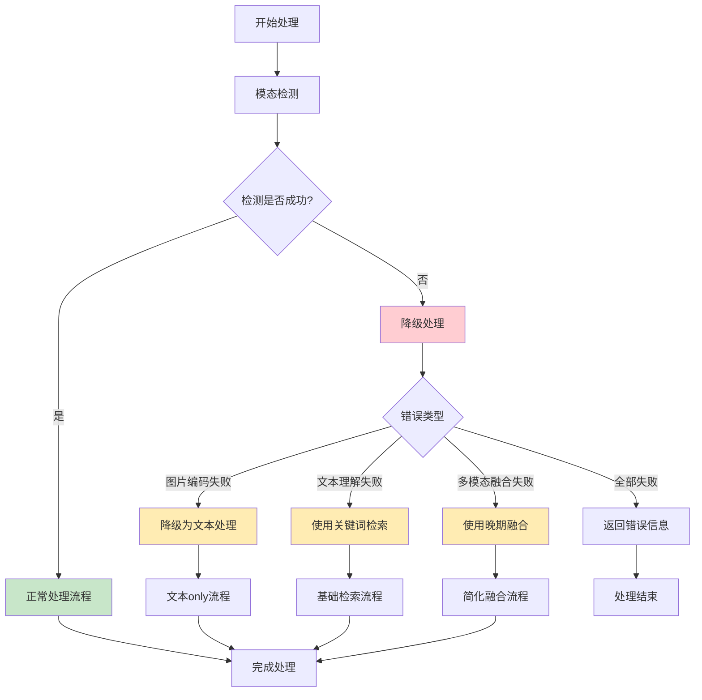

## 1. 系统总体处理流程

```mermaid
graph TD
    A[用户输入查询] --> B{模态检测}
    
    B -->|纯文本| C[文本查询处理流程]
    B -->|文本+图片| D[多模态查询处理流程]
    B -->|纯图片| E[图像查询处理流程]
    B -->|其他组合| F[混合模态处理流程]
    
    C --> G[生成回答]
    D --> G
    E --> G
    F --> G
    
    G --> H[返回多模态响应]

    style C fill:#e1f5fe
    style D fill:#f3e5f5
    style E fill:#e8f5e8
```

## 2. 纯文本提问处理流程

```mermaid
graph TD
    A[输入文本查询] --> B[文本编码器编码]
    
    B --> C[多模态检索策略]
    
    C --> D[文本语义检索]
    C --> E[跨模态检索]
    C --> F[关键词辅助检索]
    
    D --> G[获取文本片段]
    E --> H[获取相关图像/表格]
    F --> I[获取补充内容]
    
    G --> J[结果融合与重排序]
    H --> J
    I --> J
    
    J --> K[文本中心回答生成]
    
    K --> L[输出文本回答<br>+引用来源]
    
    subgraph 检索配置
        M[模态权重: text=0.7, image=0.2, table=0.1]
        N[目标模态: 文本, 图像, 表格]
        O[top_k: 10-15]
    end
    
    C -.-> 检索配置
    
    style D fill:#bbdefb
    style E fill:#c8e6c9
    style F fill:#ffecb3
    style K fill:#e1f5fe
```

## 3. 文本+提问处理流程

```mermaid
graph TD
    A[输入文本查询] --> B[文本编码器编码]
    A2[输入图片] --> C[图像编码器编码]
    
    B --> D[多模态融合]
    C --> D
    
    D --> E{选择融合策略}
    
    E -->|早期融合| F[向量拼接+降维]
    E -->|晚期融合| G[加权组合]
    E -->|交叉注意力| H[交叉注意力融合]
    
    F --> I[多模态检索]
    G --> I
    H --> I
    
    I --> J[融合向量检索]
    I --> K[视觉相似性检索]
    I --> L[文本相似性检索]
    
    J --> M[结果聚合]
    K --> M
    L --> M
    
    M --> N[多模态重排序]
    
    N --> O[多模态回答生成]
    
    O --> P[输出多模态回答<br>+图文引用<br>+视觉参考]
    
    subgraph 融合策略
        Q[早期融合: 向量拼接]
        R[晚期融合: 动态权重]
        S[交叉注意力: 深度交互]
    end
    
    D -.-> 融合策略
    
    style J fill:#bbdefb
    style K fill:#c8e6c9
    style L fill:#ffecb3
    style O fill:#f3e5f5
```

## 4. 多模态检索详细流程

```mermaid
graph LR
    A[查询输入] --> B{查询类型判断}
    
    B -->|文本查询| C[文本编码]
    B -->|多模态查询| D[多模态编码]
    
    C --> E[执行检索]
    D --> E
    
    E --> F[Milvus向量检索]
    
    F --> G{检索模式}
    
    G -->|统一检索| H[多模态集合检索]
    G -->|分模态检索| I[分集合检索]
    
    H --> J[结果返回]
    I --> K[文本集合检索]
    I --> L[图像集合检索]
    I --> M[表格集合检索]
    I --> N[音频集合检索]
    
    K --> O[结果融合]
    L --> O
    M --> O
    N --> O
    
    O --> P[重排序]
    J --> P
    
    P --> Q[最终结果]
    
    style H fill:#e1f5fe
    style I fill:#f3e5f5
    style P fill:#c8e6c9
```

## 5. 回答生成对比流程

```mermaid
graph LR
    A[查询输入] --> B{查询类型判断}
    
    B -->|文本查询| C[文本编码]
    B -->|多模态查询| D[多模态编码]
    
    C --> E[执行检索]
    D --> E
    
    E --> F[Milvus向量检索]
    
    F --> G{检索模式}
    
    G -->|统一检索| H[多模态集合检索]
    G -->|分模态检索| I[分集合检索]
    
    H --> J[结果返回]
    I --> K[文本集合检索]
    I --> L[图像集合检索]
    I --> M[表格集合检索]
    I --> N[音频集合检索]
    
    K --> O[结果融合]
    L --> O
    M --> O
    N --> O
    
    O --> P[重排序]
    J --> P
    
    P --> Q[最终结果]
    
    style H fill:#e1f5fe
    style I fill:#f3e5f5
    style P fill:#c8e6c9
```

## 6. 出错与降级处理流程

```mermaid
graph TD
    A[开始处理] --> B[模态检测]
    
    B --> C{检测是否成功?}
    
    C -->|是| D[正常处理流程]
    C -->|否| E[降级处理]
    
    D --> F[完成处理]
    
    E --> G{错误类型}
    
    G -->|图片编码失败| H[降级为文本处理]
    G -->|文本理解失败| I[使用关键词检索]
    G -->|多模态融合失败| J[使用晚期融合]
    G -->|全部失败| K[返回错误信息]
    
    H --> L[文本only流程]
    I --> M[基础检索流程]
    J --> N[简化融合流程]
    
    L --> F
    M --> F
    N --> F
    K --> O[处理结束]
    
    style D fill:#c8e6c9
    style E fill:#ffcdd2
    style H fill:#ffecb3
    style I fill:#ffecb3
    style J fill:#ffecb3
```