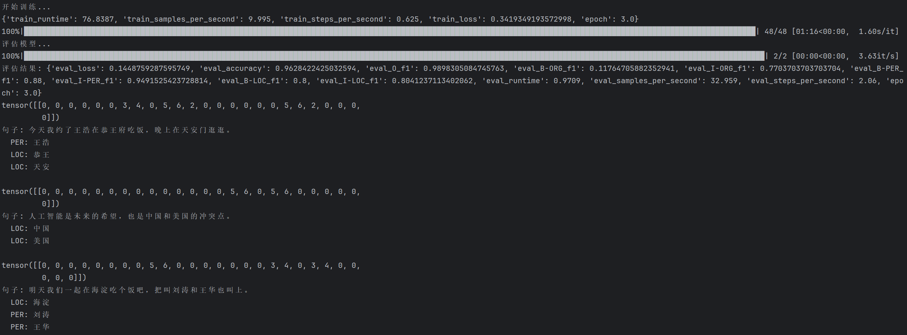
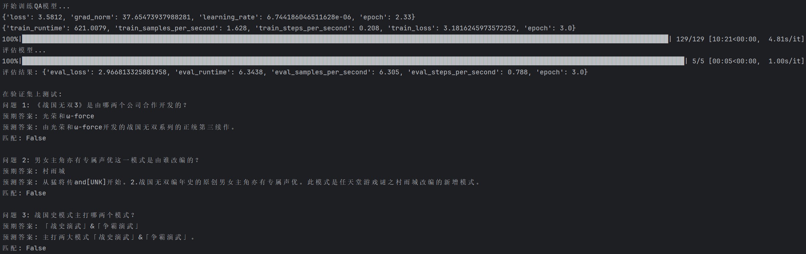

## DeepWalk与word2vec的关系
DeepWalk = 随机游走（生成数据集） + word2vec（嵌入表征）

| 方法        | 单输入 | 嵌入对象 | 上下文信息           | 数据集                           | 网络       |
|------------|------------|------|-----------------|-------------------------------|----------|
| 传统Word2Vec| 句子（单词序列）   | 单词   | 单词与句子中其他单词的语义关系 | 句子集合，相当于词表中单词允许出现的一系列分布情况     | 自然语言的语义网络 |              |
| DeepWalk   | 游走得到的节点序列 | 节点   | 节点与网络中其他节点的网络关系 | 随机游走的若干节点序列，相当于点集中节点允许出现的连接关系 | 某个特定的网络 |

启发：网络图 <==> 分布
任意具有可识别可分割最小元素（单词、节点），具有一定分布规律，可能还有些其他条件的群，可以考虑视为网络，
而任意网络都可以考虑word2vec进行嵌入。
网络的边信息（上下文关系）蕴含在每个节点的嵌入向量中。

## 微调，04数据集

## 微调，05数据集

