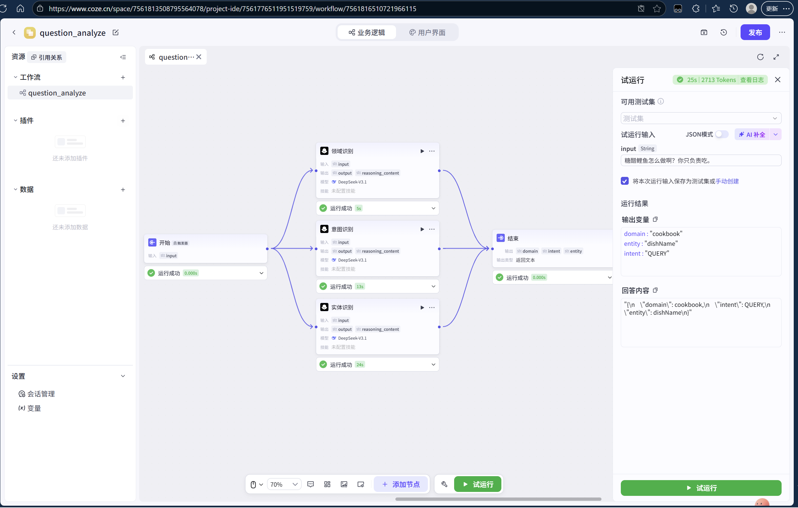
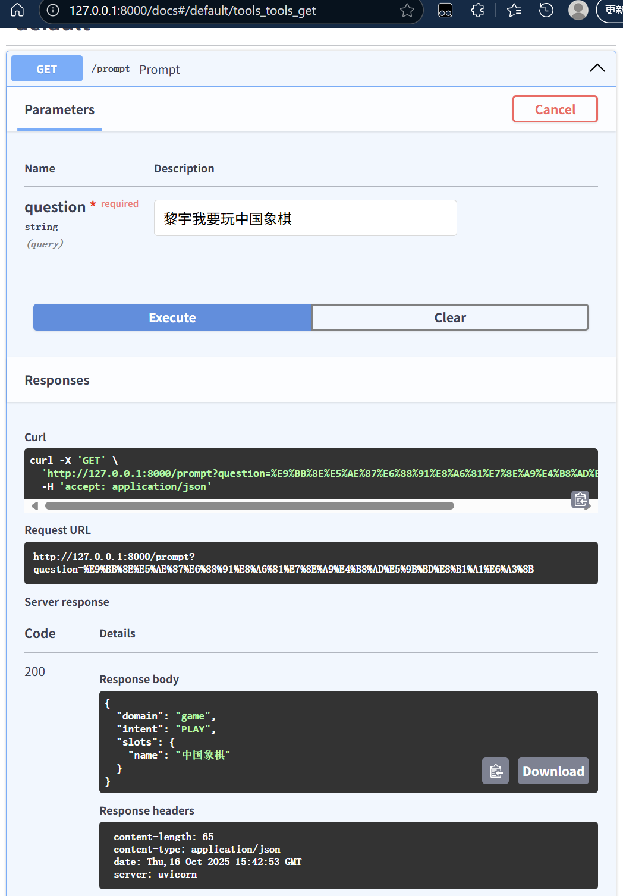
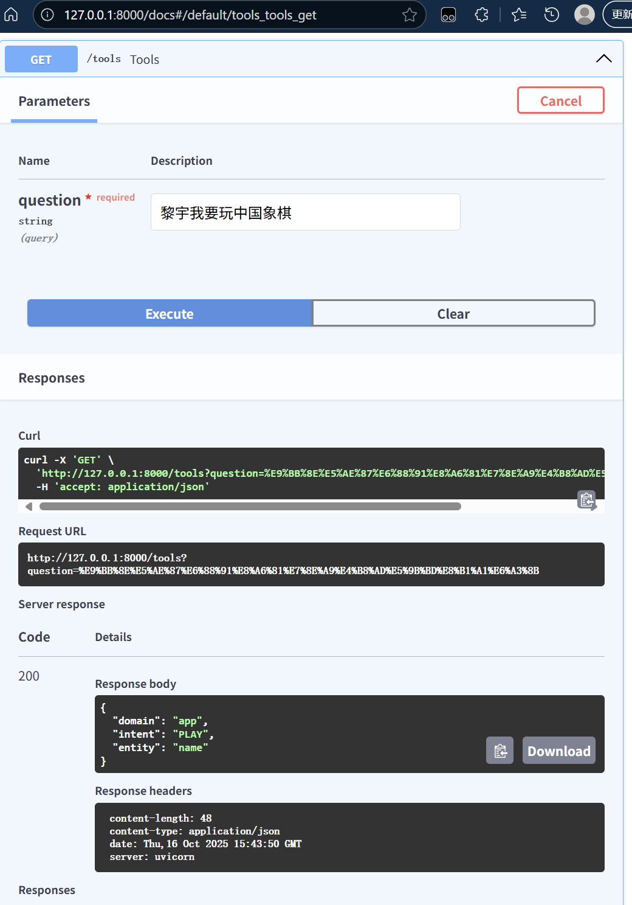

# 作业1
autodl账号id 提交为作业，方面老师共享镜像。（本地有环境的，可以不用提供，这个不是必须的，也不需要提交）
- [√] 已发班主任

# 作业2
使用讲解大模型开发流程（提示词、tools、coze/dify）尝试写一下解决意图识别 + 领域识别 + 实体识别的过程。最终效果替代02-joint-bert-training-only
可以优先使用coze，不部署dify。
1. 提示词方案
- 用户提问：*"帮忙打开一下酷狗音乐播放音乐行不"*
- 返回Choice：
[Choice(finish_reason='stop', index=0, logprobs=None, message=ChatCompletionMessage(content='{
\n    "domain": "music",\n    "intent": "LAUNCH",\n    "slots": {\n      "name": "酷狗音乐"\n 
   }\n}', refusal=None, role='assistant', annotations=None, audio=None, function_call=None, tool_calls=None))]
2. Tools方案
- 用户提问：*"帮我查询下从北京到天津到武汉的汽车票"*
- 返回结果：
{'domain': 'bus', 'intent': 'QUERY', 'entity': 'startLoc_city, endLoc_city'}
3. Coze方案

# 作业3
把作业2完成的提示词 + tools的代码，使用fastapi部署。
- 部署测试结果：

