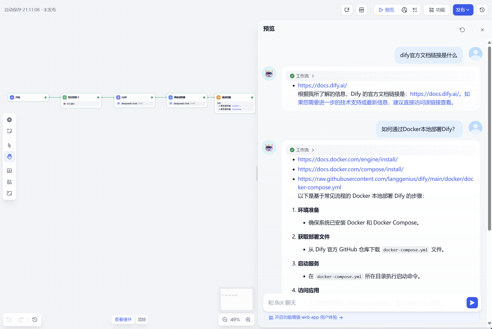

## 【作业1】大家通过本地 或 docker 安装dify，对比下工作流和对话流的使用。
工作流：接收一轮输入后，执行出一轮结果就结束该轮，有始有终。

对话流：通常支持多轮输入输出，可以带有反馈，历史输入输出可以影响后续输出。

## 【作业2】使用dify搭建一个穿衣智能指南，输入天气、温度、湿度，让大模型给出穿衣建议。
[穿衣智能指南.yml](%B4%A9%D2%C2%D6%C7%C4%DC%D6%B8%C4%CF.yml)

## 【作业3】创建一个知识库，上传一些文档，在dify实现基于文档的问答。
[dify知识问答.yml](dify%D6%AA%CA%B6%CE%CA%B4%F0.yml)

