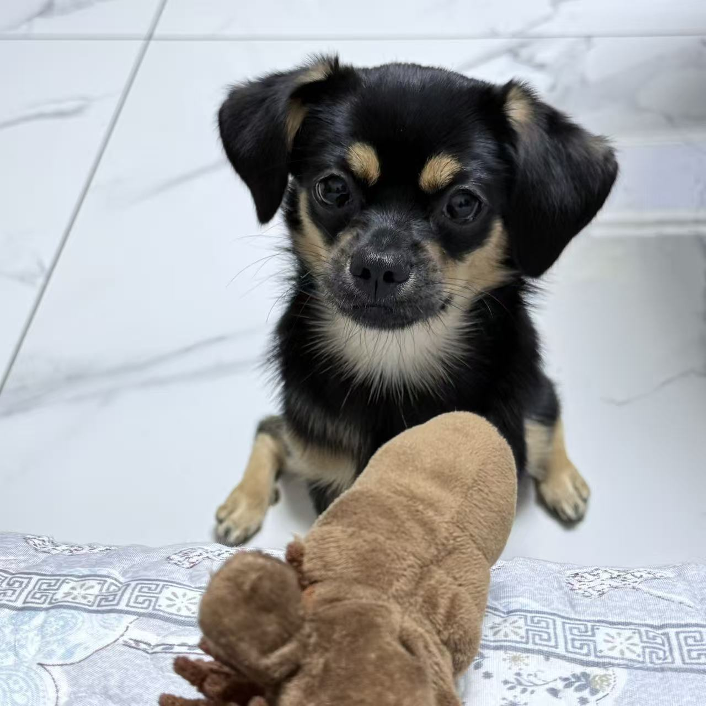
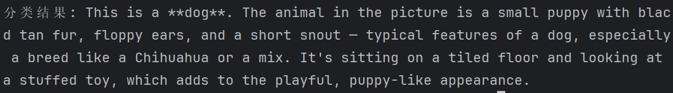
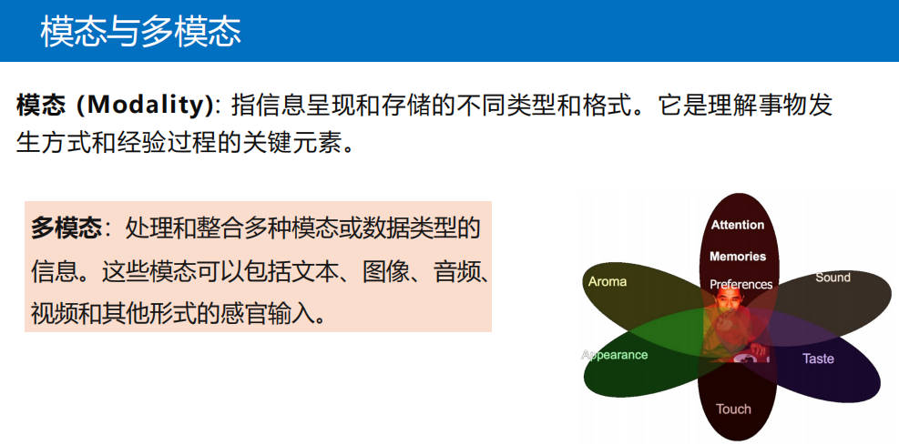
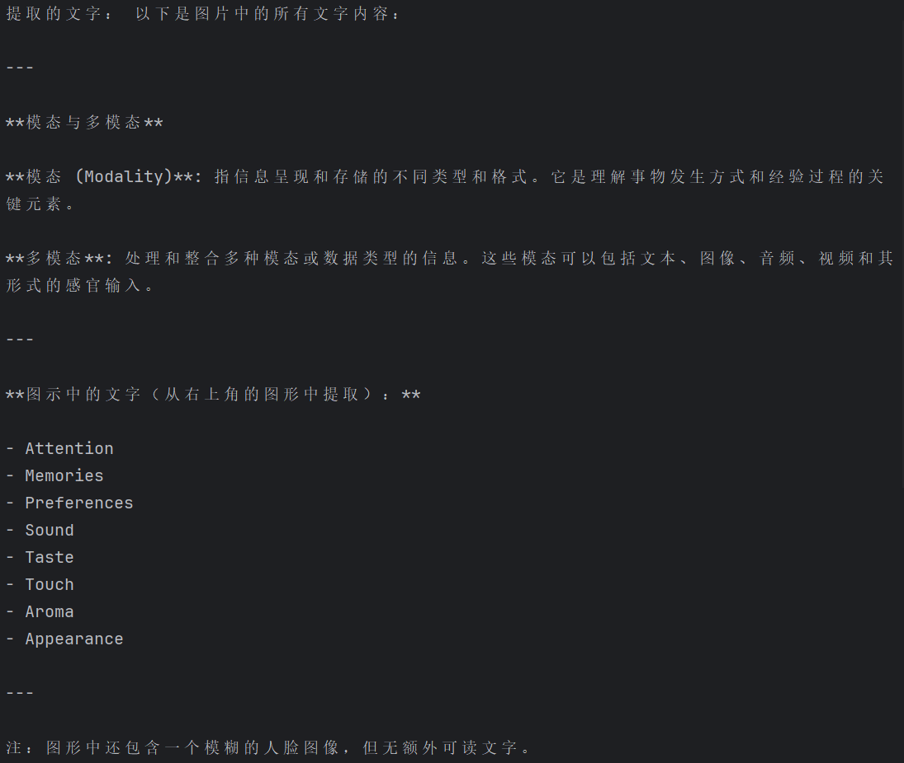
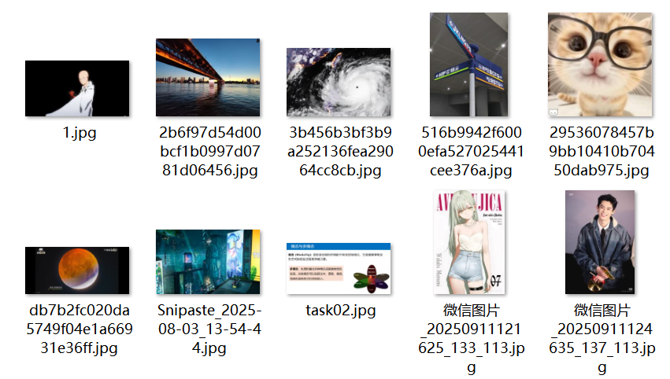

## 作业1：使用云端qwen-vl模型，完成图的分类，输入dog，识别 dog or cat？
https://bailian.console.aliyun.com/?tab=model#/efm/model_experience_center/vision

## 作业2：使用云端qwen-vl模型，完成带文字截图的图，文本的解析转换为文本。

## 作业3: 加载中文的clip模型，只要cpu推理，跑完 01-CLIP模型.ipynb
https://www.modelscope.cn/models/AI-ModelScope/chinese-clip-vit-base-patch16
可以不用原始数据，任意10个图 10个文本，完成图文匹配。

匹配准确率9/10，失误图文如下，描述问题可以理解

预期结果："一条很长的大桥延伸至远处"，
匹配结果："一个夜幕下的赛博朋克风格城市"
