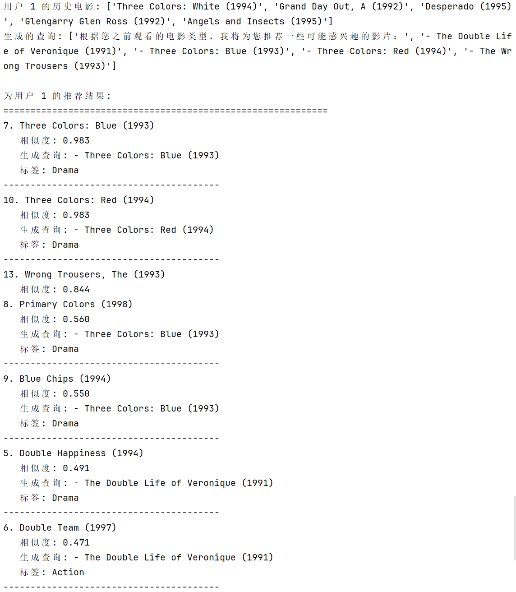

## 1、阅读 gpt4rec的论文，总结实施过程。
### 一、生成用户兴趣查询
从用户历史行为中捕捉多样化的兴趣点。

• **从历史数据构建输入：** 用户的历史物品标题（如购买记录）被格式化为特定提示。

• **生成式语言模型：** 采用生成式语言模型，基于条件分布序列生成查询。

• **多查询束搜索技术：** 算法逐步扩展查询序列，选择得分最高的候选，确保查询在不同方面（如产品类别或品牌）和粒度上具有多样性。

### 二、检索相关推荐物品
根据生成的查询从物品库中检索个性化推荐。

• **搜索引擎应用：** 使用搜索引擎（如BM25）作为“判别器”，计算查询与物品标题的相似度。

• **检索与组合策略：** 对于每个生成的查询，检索 top-K 物品，然后按顺序从其他查询中添加非重复物品，确保推荐结果覆盖用户多兴趣，同时避免重复。

• **输出推荐列表：** 最终输出是一个排序的物品列表，直接作为推荐结果。

## 2、写完04_GPT4Rec.py，写完可运行。

