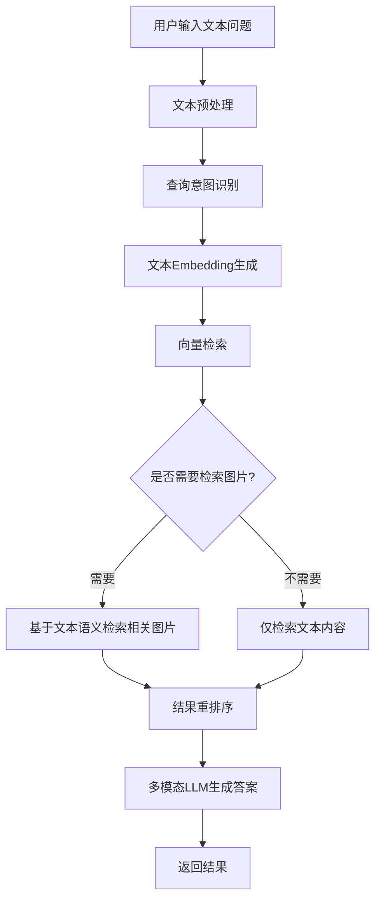
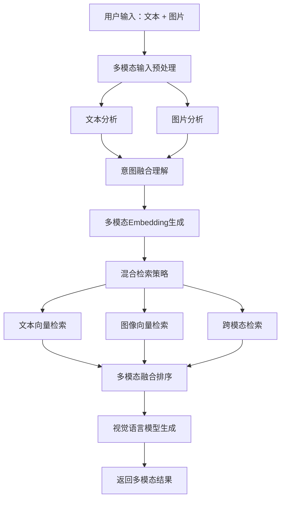
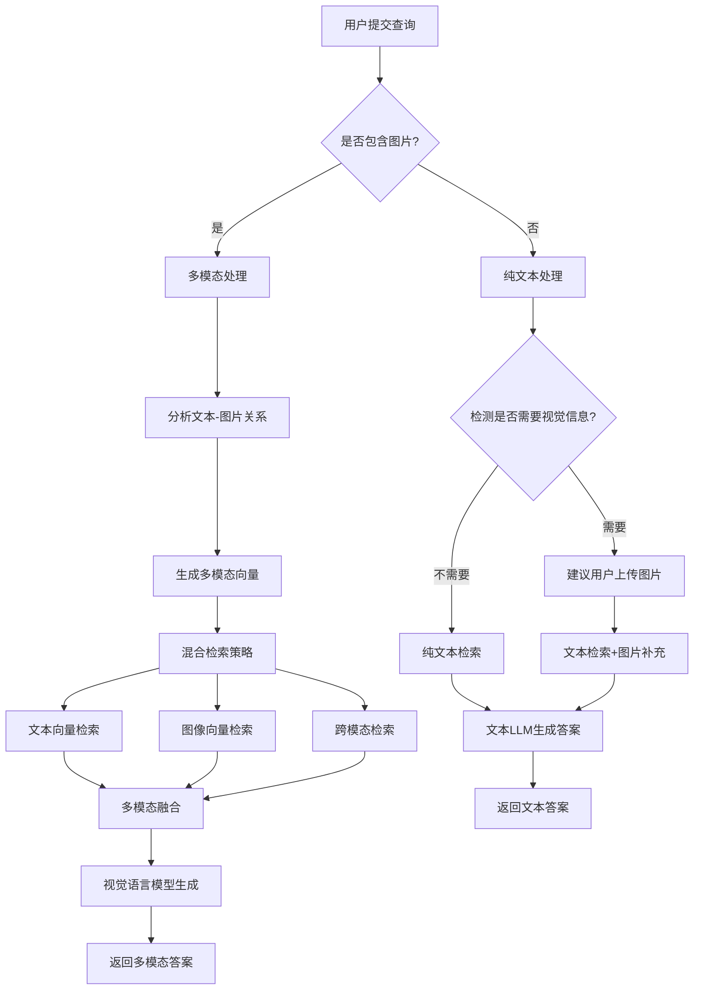

# 多模态RAG系统：文本提问 vs 文本+图提问处理策略

## 目录
- [1. 概述](#1-概述)
- [2. 纯文本提问处理](#2-纯文本提问处理)
- [3. 文本+图提问处理](#3-文本图提问处理)
- [4. 核心区别对比](#4-核心区别对比)
- [5. 技术实现方案](#5-技术实现方案)
- [6. 最佳实践与优化](#6-最佳实践与优化)
- [7. 实际案例分析](#7-实际案例分析)

---

## 1. 概述

在多模态RAG系统中，用户的查询方式直接影响系统的检索策略和处理流程。本文档详细分析两种主要查询模式的处理差异。

### 1.1 查询模式分类

| 查询类型 | 输入形式 | 典型场景 |
|---------|---------|---------|
| **纯文本提问** | 仅包含文字描述 | "这个产品的技术参数是什么？" |
| **文本+图提问** | 文字 + 图片 | "这个部件（附图）的安装步骤是什么？" |

---

## 2. 纯文本提问处理

### 2.1 处理流程



### 2.2 详细步骤

#### Step 1: 文本预处理
```python
def preprocess_text_query(query: str) -> dict:
    """
    纯文本查询预处理
    """
    return {
        "raw_query": query,
        "cleaned_query": clean_text(query),
        "keywords": extract_keywords(query),
        "intent": classify_intent(query),  # 问答/检索/推荐等
        "language": detect_language(query),
        "query_type": "text_only"
    }
```

**处理内容**：
- 去除噪声字符、标点规范化
- 提取关键词和实体
- 识别查询意图（事实问答、操作指导、概念解释等）
- 判断是否需要视觉信息辅助

#### Step 2: 查询理解与扩展
```python
def understand_text_query(query: str) -> dict:
    """
    理解文本查询的深层语义
    """
    understanding = {
        "main_intent": "查找产品参数",
        "entities": ["产品型号X", "技术参数"],
        "implicit_needs": {
            "need_visual": False,  # 纯文本即可回答
            "need_table": True,     # 可能需要表格信息
            "need_comparison": False
        },
        "query_expansion": [
            "产品X的规格",
            "X型号技术指标",
            "X参数配置表"
        ]
    }
    return understanding
```

#### Step 3: 检索策略

**策略A: 纯文本检索**
```python
def text_only_retrieval(query_embedding, top_k=10):
    """
    仅检索文本内容
    """
    results = {
        "text_chunks": vector_search(
            query_embedding=query_embedding,
            index_type="text",
            top_k=top_k,
            filters={"content_type": "text"}
        ),
        "images": []  # 不检索图片
    }
    return results
```

**策略B: 文本主导 + 图片辅助**
```python
def text_with_image_support(query_embedding, top_k=10):
    """
    文本为主，检索相关图片作为补充
    """
    # 先检索文本
    text_results = vector_search(
        query_embedding=query_embedding,
        index_type="text",
        top_k=top_k
    )

    # 基于文本上下文检索相关图片
    image_results = []
    if need_visual_support(text_results):
        image_results = retrieve_contextual_images(
            text_chunks=text_results,
            top_k=3  # 少量图片作为补充
        )

    return {
        "text_chunks": text_results,
        "images": image_results
    }
```

#### Step 4: 答案生成

```python
def generate_answer_from_text(query, retrieved_context):
    """
    基于纯文本查询生成答案
    """
    prompt = f"""
    基于以下检索到的信息回答问题：

    问题：{query}

    相关信息：
    {format_text_context(retrieved_context)}

    请提供准确、简洁的答案。
    """

    answer = llm_generate(
        prompt=prompt,
        model="gpt-4",  # 可以使用文本LLM
        temperature=0.7
    )

    return answer
```

### 2.3 适用场景

✅ **适合纯文本提问的场景**：
- 概念性问题："什么是RAG？"
- 事实性查询："公司成立于哪一年？"
- 流程描述："如何申请退款？"
- 政策规定："员工假期政策是什么？"
- 数据查询："去年的销售额是多少？"

❌ **不适合纯文本提问的场景**：
- 需要识别具体物品："这是什么品种的花？"（附图）
- 视觉相关问题："这个产品的外观设计如何？"
- 复杂结构说明："这个图表显示了什么趋势？"

---

## 3. 文本+图提问处理

### 3.1 处理流程



### 3.2 详细步骤

#### Step 1: 多模态输入预处理

```python
def preprocess_multimodal_query(text: str, image: Image) -> dict:
    """
    文本+图片查询预处理
    """
    # 文本处理
    text_features = {
        "raw_text": text,
        "cleaned_text": clean_text(text),
        "keywords": extract_keywords(text),
        "intent": classify_intent(text)
    }

    # 图像处理
    image_features = {
        "image_data": image,
        "image_caption": generate_caption(image),  # 图片描述
        "detected_objects": detect_objects(image),  # 目标检测
        "ocr_text": extract_text_from_image(image),  # OCR文本
        "image_embedding": encode_image(image),
        "visual_features": {
            "colors": extract_colors(image),
            "shapes": detect_shapes(image),
            "scene_type": classify_scene(image)
        }
    }

    # 文本-图像关系分析
    relationship = analyze_text_image_relation(text, image)

    return {
        "query_type": "multimodal",
        "text_features": text_features,
        "image_features": image_features,
        "relationship": relationship,  # 补充/指代/对比等
        "timestamp": datetime.now()
    }
```

#### Step 2: 图文关系理解

**关键：理解文本和图片之间的关系**

```python
def analyze_text_image_relation(text: str, image: Image) -> dict:
    """
    分析文本和图片的关系类型
    """
    relation_types = {
        "reference": False,      # 文本指代图片："这个零件的尺寸是多少？"
        "supplement": False,     # 图片补充文本："安装步骤如下（附图）"
        "comparison": False,     # 对比关系："我的产品（附图）和你们的有什么区别？"
        "question_about": False, # 对图片提问："图中的建筑是什么？"
        "context": False         # 提供上下文："在这个场景下（附图），如何操作？"
    }

    # 检测指代词
    if has_demonstrative_pronouns(text):  # "这个"、"那个"、"图中"
        relation_types["reference"] = True

    # 检测疑问词 + 视觉相关词
    if contains_visual_question(text):  # "是什么"、"怎么看"
        relation_types["question_about"] = True

    # 图像内容和文本语义匹配
    image_content = get_image_content_description(image)
    semantic_overlap = calculate_semantic_similarity(text, image_content)

    if semantic_overlap > 0.7:
        relation_types["supplement"] = True

    return {
        "primary_relation": get_primary_relation(relation_types),
        "all_relations": relation_types,
        "confidence": 0.85
    }
```

**关系类型示例**：

| 关系类型 | 示例 | 处理重点 |
|---------|------|---------|
| **指代关系** | "这个部件的型号是什么？"（附图） | 图片是主体，文本提问 |
| **补充关系** | "按照以下步骤操作（附图）" | 图片辅助说明文本 |
| **对比关系** | "我的设备（附图）和标准版的区别？" | 需要对比检索 |
| **问图关系** | "图中的标志是什么意思？" | 完全基于图片内容 |

#### Step 3: 多模态Embedding生成

```python
def generate_multimodal_embedding(text: str, image: Image) -> dict:
    """
    生成融合的多模态向量
    """
    # 方案1: 独立编码
    text_embedding = text_encoder.encode(text)
    image_embedding = image_encoder.encode(image)

    # 方案2: 联合编码（使用CLIP等模型）
    joint_embedding = clip_model.encode(text=text, image=image)

    # 方案3: 加权融合
    weight_text = calculate_text_weight(text, image)
    weight_image = 1 - weight_text

    fused_embedding = (
        weight_text * text_embedding +
        weight_image * image_embedding
    )

    return {
        "text_embedding": text_embedding,
        "image_embedding": image_embedding,
        "joint_embedding": joint_embedding,
        "fused_embedding": fused_embedding,
        "weights": {
            "text": weight_text,
            "image": weight_image
        }
    }
```

#### Step 4: 混合检索策略

```python
def multimodal_retrieval(query_text, query_image, top_k=10):
    """
    多模态混合检索
    """
    # 生成多模态向量
    embeddings = generate_multimodal_embedding(query_text, query_image)

    # 策略1: 文本向量检索文本内容
    text_results = vector_search(
        query_embedding=embeddings["text_embedding"],
        index_type="text",
        top_k=top_k * 2
    )

    # 策略2: 图像向量检索图像内容
    image_results = vector_search(
        query_embedding=embeddings["image_embedding"],
        index_type="image",
        top_k=top_k
    )

    # 策略3: 联合向量跨模态检索
    cross_modal_results = {
        "text_by_image": vector_search(
            query_embedding=embeddings["image_embedding"],
            index_type="text",  # 用图片向量检索文本
            top_k=top_k
        ),
        "image_by_text": vector_search(
            query_embedding=embeddings["text_embedding"],
            index_type="image",  # 用文本向量检索图片
            top_k=top_k
        )
    }

    # 策略4: 基于查询图片的相似图片检索
    similar_images = find_similar_images(
        query_image=query_image,
        top_k=5,
        similarity_threshold=0.75
    )

    # 多模态结果融合
    fused_results = fuse_multimodal_results(
        text_results=text_results,
        image_results=image_results,
        cross_modal_results=cross_modal_results,
        similar_images=similar_images,
        fusion_strategy="weighted_rrf"  # Reciprocal Rank Fusion
    )

    return fused_results
```

#### Step 5: 多模态结果融合与排序

```python
def fuse_multimodal_results(text_results, image_results,
                            cross_modal_results, similar_images,
                            fusion_strategy="weighted_rrf"):
    """
    融合多个检索结果
    """
    if fusion_strategy == "weighted_rrf":
        # Reciprocal Rank Fusion (RRF)
        fused_scores = {}
        k = 60  # RRF参数

        # 文本检索结果
        for rank, item in enumerate(text_results):
            item_id = item["id"]
            fused_scores[item_id] = fused_scores.get(item_id, 0) + \
                                    0.4 / (k + rank + 1)  # 权重0.4

        # 图像检索结果
        for rank, item in enumerate(image_results):
            item_id = item["id"]
            fused_scores[item_id] = fused_scores.get(item_id, 0) + \
                                    0.3 / (k + rank + 1)  # 权重0.3

        # 跨模态检索结果
        for rank, item in enumerate(cross_modal_results["text_by_image"]):
            item_id = item["id"]
            fused_scores[item_id] = fused_scores.get(item_id, 0) + \
                                    0.2 / (k + rank + 1)  # 权重0.2

        for rank, item in enumerate(cross_modal_results["image_by_text"]):
            item_id = item["id"]
            fused_scores[item_id] = fused_scores.get(item_id, 0) + \
                                    0.1 / (k + rank + 1)  # 权重0.1

        # 排序
        sorted_items = sorted(fused_scores.items(),
                             key=lambda x: x[1],
                             reverse=True)

        return rerank_with_multimodal_model(sorted_items)

    elif fusion_strategy == "weighted_sum":
        # 加权评分融合
        # ... 其他融合策略
        pass
```

#### Step 6: 视觉语言模型生成答案

```python
def generate_multimodal_answer(query_text, query_image, retrieved_context):
    """
    使用视觉语言模型生成答案
    """
    # 必须使用支持视觉的LLM
    prompt = construct_multimodal_prompt(
        query_text=query_text,
        query_image=query_image,
        text_context=retrieved_context["text_chunks"],
        image_context=retrieved_context["images"]
    )

    answer = vision_llm.generate(
        prompt=prompt,
        images=[query_image] + retrieved_context["images"],
        model="gpt-4-vision" / "claude-3-opus" / "qwen-vl-max",
        temperature=0.7,
        max_tokens=1024
    )

    return {
        "answer": answer,
        "visual_references": extract_visual_references(answer),
        "confidence": calculate_confidence(answer, retrieved_context)
    }

def construct_multimodal_prompt(query_text, query_image,
                                text_context, image_context):
    """
    构建多模态prompt
    """
    prompt = f"""
    用户提供了一张图片并提问：{query_text}

    请仔细观察用户提供的图片，结合以下检索到的相关信息回答问题：

    ## 相关文本信息：
    {format_text_context(text_context)}

    ## 相关图片信息：
    检索到 {len(image_context)} 张相关图片（已附加）

    请基于用户提供的图片和检索到的信息，给出准确的答案。
    如果问题涉及图片中的具体内容，请明确说明。
    """

    return prompt
```

### 3.3 关键技术差异

#### 差异1: 模型选择

| 方面 | 纯文本提问 | 文本+图提问 |
|-----|-----------|------------|
| **Embedding模型** | 文本编码器（BERT, BGE） | 多模态编码器（CLIP, BLIP2） |
| **LLM模型** | 文本LLM（GPT-4, Claude） | 视觉LLM（GPT-4V, Claude-3, Qwen-VL） |
| **检索索引** | 文本向量索引 | 文本 + 图像 + 跨模态索引 |

#### 差异2: 计算复杂度

```python
# 纯文本提问
complexity_text_only = {
    "embedding_time": "~50ms",
    "retrieval_time": "~100ms",
    "generation_time": "~1-2s",
    "total": "~1.5-2.5s"
}

# 文本+图提问
complexity_multimodal = {
    "image_preprocessing": "~200ms",  # 图像编码、特征提取
    "multimodal_embedding": "~150ms",  # 双模态编码
    "multi_index_retrieval": "~300ms",  # 多索引检索+融合
    "vision_llm_generation": "~3-5s",  # 视觉模型推理更慢
    "total": "~4-6s"
}
```

#### 差异3: 检索范围

```python
# 纯文本提问 - 检索范围
text_query_scope = {
    "primary_search": ["text_chunks"],
    "optional_search": ["related_images"],  # 可选
    "search_modes": 1
}

# 文本+图提问 - 检索范围
multimodal_query_scope = {
    "primary_search": [
        "text_chunks",
        "image_database",
        "cross_modal_index"
    ],
    "advanced_search": [
        "similar_images",      # 以图搜图
        "text_by_image",       # 图搜文
        "image_by_text",       # 文搜图
        "object_detection"     # 物体识别
    ],
    "search_modes": 4-6
}
```

---

## 4. 核心区别对比

### 4.1 架构差异

```
┌─────────────────────────────────────────────────────────────┐
│                      纯文本提问流程                            │
├─────────────────────────────────────────────────────────────┤
│  用户问题 → 文本编码 → 向量检索(文本) → 文本LLM → 答案        │
│                            ↓                                 │
│                    （可选）图片补充                            │
└─────────────────────────────────────────────────────────────┘

┌─────────────────────────────────────────────────────────────┐
│                    文本+图提问流程                            │
├─────────────────────────────────────────────────────────────┤
│  文本问题 ──┐                                                │
│            ├─→ 多模态编码 ──┬─→ 向量检索(文本)               │
│  图片内容 ──┘               ├─→ 向量检索(图像)               │
│                            ├─→ 跨模态检索                    │
│                            └─→ 以图搜图                      │
│                                   ↓                          │
│                            多模态结果融合                      │
│                                   ↓                          │
│                            视觉语言模型                        │
│                                   ↓                          │
│                          多模态答案（文本+图片引用）            │
└─────────────────────────────────────────────────────────────┘
```

### 4.2 详细对比表

| 维度 | 纯文本提问 | 文本+图提问 |
|-----|-----------|------------|
| **输入处理** | 文本清洗、分词 | 文本处理 + 图像编码 + 关系理解 |
| **语义理解** | 单模态语义分析 | 多模态语义对齐与融合 |
| **Embedding** | 文本向量（768/1024维） | 文本向量 + 图像向量 + 联合向量 |
| **检索策略** | 单一文本检索 | 多路检索（文本/图像/跨模态） |
| **检索结果** | 主要是文本块 | 文本块 + 图像 + 多模态内容 |
| **融合算法** | 简单排序/重排 | 多模态融合（RRF/加权/学习排序） |
| **LLM需求** | 文本模型即可 | 必须使用视觉语言模型 |
| **答案形式** | 纯文本 | 文本 + 图片引用 + 视觉解释 |
| **延迟** | 1.5-2.5s | 4-6s |
| **成本** | 低 | 高（2-3倍） |
| **准确性** | 依赖文本描述完整性 | 更高（直接理解视觉内容） |

### 4.3 能力边界对比

```python
# 纯文本提问的局限
text_only_limitations = {
    "视觉识别": "无法直接识别图片内容",
    "空间理解": "难以理解位置、布局关系",
    "外观描述": "只能依赖文字描述，可能不准确",
    "细节观察": "无法观察细微的视觉差异",
    "实物比对": "无法将实物照片与知识库匹配"
}

# 文本+图提问的优势
multimodal_advantages = {
    "直接识别": "可以直接识别图片中的物体、场景",
    "视觉理解": "理解图片的视觉特征、颜色、形状",
    "上下文增强": "图片提供了文本难以表达的上下文",
    "精确匹配": "可以找到视觉上相似的内容",
    "跨模态推理": "结合文本和图像进行综合推理"
}
```

---

## 5. 技术实现方案

### 5.1 统一查询处理接口

```python
class MultimodalQueryHandler:
    """
    统一的多模态查询处理器
    """
    def __init__(self):
        self.text_encoder = TextEncoder("bge-large-zh")
        self.image_encoder = ImageEncoder("clip-vit-large")
        self.multimodal_encoder = MultimodalEncoder("blip2")
        self.text_llm = TextLLM("gpt-4")
        self.vision_llm = VisionLLM("gpt-4-vision")
        self.retriever = HybridRetriever()

    def process_query(self, text: str, image: Optional[Image] = None):
        """
        统一查询入口，自动判断处理策略
        """
        if image is None:
            return self._process_text_only(text)
        else:
            return self._process_multimodal(text, image)

    def _process_text_only(self, text: str):
        """处理纯文本查询"""
        # 1. 预处理
        processed = self.preprocess_text(text)

        # 2. 判断是否需要视觉信息
        need_visual = self.detect_visual_need(text)

        # 3. 生成embedding
        text_embedding = self.text_encoder.encode(text)

        # 4. 检索
        if need_visual:
            results = self.retriever.retrieve_with_images(
                text_embedding=text_embedding,
                top_k=10
            )
        else:
            results = self.retriever.retrieve_text_only(
                text_embedding=text_embedding,
                top_k=10
            )

        # 5. 生成答案
        answer = self.text_llm.generate(
            query=text,
            context=results
        )

        return {
            "query_type": "text_only",
            "answer": answer,
            "sources": results,
            "processing_time": "1.5s"
        }

    def _process_multimodal(self, text: str, image: Image):
        """处理多模态查询"""
        # 1. 多模态预处理
        processed = self.preprocess_multimodal(text, image)

        # 2. 理解文本-图像关系
        relation = self.analyze_relation(text, image)

        # 3. 生成多模态embedding
        embeddings = self.generate_multimodal_embeddings(text, image)

        # 4. 混合检索
        results = self.retriever.multimodal_retrieve(
            text_embedding=embeddings["text"],
            image_embedding=embeddings["image"],
            joint_embedding=embeddings["joint"],
            relation=relation,
            top_k=10
        )

        # 5. 多模态融合
        fused_results = self.fuse_results(results, relation)

        # 6. 视觉语言模型生成
        answer = self.vision_llm.generate(
            query_text=text,
            query_image=image,
            context=fused_results
        )

        return {
            "query_type": "multimodal",
            "answer": answer,
            "sources": fused_results,
            "relation_type": relation["primary_relation"],
            "processing_time": "4.5s"
        }

    def detect_visual_need(self, text: str) -> bool:
        """
        检测文本查询是否需要视觉信息支持
        """
        visual_keywords = [
            "图", "图片", "照片", "外观", "样子", "颜色",
            "形状", "设计", "界面", "显示", "图表", "示意图"
        ]

        # 关键词匹配
        if any(keyword in text for keyword in visual_keywords):
            return True

        # 使用分类模型判断
        visual_prob = self.visual_need_classifier.predict(text)
        return visual_prob > 0.7
```

### 5.2 自适应检索策略

```python
class AdaptiveRetrievalStrategy:
    """
    根据查询类型自适应选择检索策略
    """
    def select_strategy(self, query_type, text, image=None):
        """
        选择最优检索策略
        """
        if query_type == "text_only":
            if self.is_factual_question(text):
                return "precise_text_search"
            elif self.contains_visual_terms(text):
                return "text_with_image_support"
            else:
                return "pure_text_search"

        elif query_type == "multimodal":
            relation = self.analyze_text_image_relation(text, image)

            if relation == "reference":  # "这个部件"
                return "image_dominant_search"
            elif relation == "question_about":  # "图中是什么"
                return "image_understanding_search"
            elif relation == "comparison":  # 对比
                return "comparative_multimodal_search"
            else:
                return "balanced_multimodal_search"

    def image_dominant_search(self, text, image):
        """
        图像主导的检索策略
        """
        # 图像权重更高
        return {
            "image_search_weight": 0.7,
            "text_search_weight": 0.3,
            "enable_similar_image": True,
            "enable_cross_modal": True
        }

    def balanced_multimodal_search(self, text, image):
        """
        平衡的多模态检索
        """
        return {
            "image_search_weight": 0.5,
            "text_search_weight": 0.5,
            "enable_all_modes": True
        }
```

### 5.3 结果呈现差异

```python
# 纯文本提问的结果格式
text_only_result = {
    "answer": "技术参数如下：处理器为Intel i7-12700K...",
    "sources": [
        {
            "type": "text",
            "content": "产品规格说明...",
            "score": 0.92
        }
    ],
    "supplementary_images": [  # 可选的补充图片
        {
            "url": "product_image.jpg",
            "caption": "产品外观图"
        }
    ]
}

# 文本+图提问的结果格式
multimodal_result = {
    "answer": "根据您提供的图片，这是一个Intel i7处理器...",
    "visual_analysis": {
        "identified_object": "Intel CPU",
        "key_features": ["散热器", "12代酷睿", "LGA1700接口"],
        "confidence": 0.95
    },
    "sources": [
        {
            "type": "text",
            "content": "安装说明...",
            "score": 0.89
        },
        {
            "type": "image",
            "url": "similar_cpu.jpg",
            "caption": "相似产品",
            "similarity": 0.87,
            "comparison": "您的CPU与此图相似度87%"
        }
    ],
    "related_images": [
        {
            "url": "installation_diagram.jpg",
            "caption": "安装示意图",
            "relevance": "高度相关"
        }
    ]
}
```

---

## 6. 最佳实践与优化

### 6.1 查询类型自动识别

```python
def auto_detect_query_type(text: str, image: Optional[Image] = None):
    """
    自动识别查询类型和最佳处理方式
    """
    if image is None:
        # 纯文本，但可能需要视觉支持
        visual_need_score = assess_visual_need(text)

        if visual_need_score > 0.8:
            return {
                "type": "text_only",
                "strategy": "with_visual_support",
                "suggestion": "建议用户提供图片以获得更准确的答案"
            }
        else:
            return {
                "type": "text_only",
                "strategy": "pure_text",
                "suggestion": None
            }
    else:
        # 多模态查询
        image_importance = assess_image_importance(text, image)

        return {
            "type": "multimodal",
            "strategy": "adaptive",
            "image_weight": image_importance,
            "text_weight": 1 - image_importance
        }
```

### 6.2 性能优化策略

#### 优化1: 缓存机制

```python
class QueryCache:
    """
    查询缓存，加速重复查询
    """
    def __init__(self):
        self.text_cache = LRUCache(maxsize=1000)
        self.image_cache = LRUCache(maxsize=500)
        self.result_cache = TTLCache(maxsize=2000, ttl=3600)

    def get_cached_result(self, text, image=None):
        # 文本+图像的联合hash
        cache_key = self.generate_cache_key(text, image)
        return self.result_cache.get(cache_key)

    def generate_cache_key(self, text, image):
        text_hash = hashlib.md5(text.encode()).hexdigest()
        if image:
            image_hash = self.perceptual_hash(image)  # 感知哈希
            return f"{text_hash}:{image_hash}"
        return text_hash
```

#### 优化2: 模型选择策略

```python
def select_optimal_model(query_type, complexity):
    """
    根据查询复杂度选择合适的模型
    """
    if query_type == "text_only":
        if complexity == "simple":
            return "gpt-3.5-turbo"  # 快速、便宜
        else:
            return "gpt-4"  # 更准确

    elif query_type == "multimodal":
        if complexity == "simple":  # 简单的视觉问题
            return "qwen-vl-chat"  # 较快的开源模型
        elif complexity == "medium":
            return "gpt-4-vision"
        else:  # 复杂的多模态推理
            return "claude-3-opus"  # 最强但最贵
```

#### 优化3: 分阶段处理

```python
def staged_multimodal_processing(text, image):
    """
    分阶段处理，避免不必要的计算
    """
    # 阶段1: 快速文本检索
    quick_text_results = quick_text_search(text, top_k=20)

    # 阶段2: 判断是否需要图像检索
    if has_sufficient_text_results(quick_text_results):
        # 文本结果足够好，跳过图像检索
        return generate_answer_from_text(text, quick_text_results)

    # 阶段3: 图像特征提取（仅在需要时）
    image_features = extract_image_features(image)

    # 阶段4: 图像检索
    image_results = image_search(image_features, top_k=10)

    # 阶段5: 融合与生成
    fused_results = fuse_results(quick_text_results, image_results)
    return generate_multimodal_answer(text, image, fused_results)
```

### 6.3 用户体验优化

#### 策略1: 智能提示

```python
def provide_query_suggestions(text, image=None):
    """
    根据查询类型提供优化建议
    """
    if image is None:
        # 检测是否需要图片
        if contains_visual_references(text):
            return {
                "suggestion": "您的问题似乎涉及具体物品，上传图片可获得更准确的答案",
                "confidence": 0.85
            }
    else:
        # 检测文本是否充分
        if is_text_too_vague(text):
            return {
                "suggestion": "请提供更具体的问题描述，例如您想了解图片中的什么方面？",
                "examples": [
                    "这是什么型号的产品？",
                    "如何安装图中的部件？",
                    "图中的故障现象是什么原因？"
                ]
            }
```

#### 策略2: 渐进式返回

```python
async def progressive_multimodal_response(text, image):
    """
    渐进式返回结果，提升用户体验
    """
    # 1. 立即返回图像识别结果
    yield {
        "stage": "image_recognition",
        "result": quick_image_recognition(image),
        "time": "0.5s"
    }

    # 2. 返回初步检索结果
    text_results = await text_retrieval(text)
    yield {
        "stage": "text_retrieval",
        "result": text_results[:3],
        "time": "1.0s"
    }

    # 3. 返回图像检索结果
    image_results = await image_retrieval(image)
    yield {
        "stage": "image_retrieval",
        "result": image_results[:3],
        "time": "1.5s"
    }

    # 4. 返回最终答案
    final_answer = await generate_final_answer(text, image,
                                                text_results, image_results)
    yield {
        "stage": "final_answer",
        "result": final_answer,
        "time": "4.0s"
    }
```

---

## 7. 实际案例分析

### 案例1: 产品咨询场景

#### 场景A: 纯文本提问
```
用户问题："iPhone 15 Pro的续航时间是多少？"

处理流程：
1. 文本解析 → 识别产品型号"iPhone 15 Pro"、查询属性"续航时间"
2. 向量检索 → 检索产品规格文档
3. 答案生成 → "iPhone 15 Pro的续航时间为：视频播放最长29小时，流媒体播放最长25小时..."

结果：准确、快速（1.5秒）
```

#### 场景B: 文本+图提问
```
用户问题："这款手机（附图）的续航怎么样？"
附带图片：一张模糊的手机照片

处理流程：
1. 图像识别 → 识别为"iPhone 15 Pro（置信度78%）"或"iPhone 14 Pro（置信度65%）"
2. 文本理解 → "续航怎么样"
3. 混合检索：
   - 图像相似搜索 → 找到相似产品图片
   - 文本检索 → 搜索续航相关信息
4. 答案生成 → "根据图片识别，这可能是iPhone 15 Pro。该机型续航表现..."

优势：即使用户不知道具体型号，也能回答
劣势：识别准确性依赖图片质量，耗时较长（4秒）
```

### 案例2: 技术支持场景

#### 场景A: 纯文本提问
```
用户问题："打印机显示E03错误代码是什么意思？"

处理流程：
1. 关键词提取 → "打印机"、"E03"、"错误代码"
2. 精确检索 → 查找错误代码手册
3. 答案生成 → "E03错误代码表示卡纸，请检查进纸通道..."

结果：精确匹配，快速响应
```

#### 场景B: 文本+图提问
```
用户问题："打印机显示这个错误（附图），怎么解决？"
附带图片：打印机屏幕显示错误信息的照片

处理流程：
1. OCR识别 → 从图片中提取文字"E03"
2. 图像理解 → 识别设备型号、错误位置
3. 综合检索：
   - 基于OCR文本检索错误码解释
   - 基于设备型号检索解决方案
   - 图像匹配类似故障案例
4. 答案生成 → "根据图片，您的打印机显示E03错误，这是卡纸故障。根据您的设备型号HP LaserJet Pro，解决步骤如下..."

优势：
- 用户无需手动输入错误代码
- 自动识别设备型号
- 可以理解错误的视觉表现

价值：降低用户操作门槛，提升问题解决率
```

### 案例3: 教育场景

#### 场景A: 纯文本提问
```
用户问题："解释一下什么是光合作用"

处理流程：
1. 意图识别 → 概念解释
2. 知识检索 → 检索生物学知识库
3. 答案生成 → "光合作用是植物、藻类等生物利用光能，将二氧化碳和水转化为有机物，并释放氧气的过程..."

结果：标准的文本解释
```

#### 场景B: 文本+图提问
```
用户问题："这张图中的光合作用过程有什么问题？"
附带图片：一张学生绘制的光合作用示意图（有错误）

处理流程：
1. 图像理解 → 识别图中的各个组件（叶绿体、光线、CO2、O2等）
2. 错误检测 → 对比标准图，发现错误（如箭头方向错误）
3. 知识检索 → 检索正确的光合作用流程
4. 答案生成 → "您的图中有几处错误：
   - 氧气应该是释放出来的产物，箭头方向应该向外
   - 光能应该指向叶绿体
   这是正确的流程：[附上正确示意图]"

优势：可以进行视觉诊断和教学反馈
```

### 案例4: 电商购物场景

#### 场景A: 纯文本提问
```
用户问题："有没有适合跑步的运动鞋推荐？"

处理流程：
1. 需求分析 → "跑步"、"运动鞋"
2. 产品检索 → 检索跑步鞋品类
3. 推荐生成 → "为您推荐以下跑步鞋：
   1. Nike Air Zoom Pegasus - 适合日常训练
   2. ASICS GEL-KAYANO - 提供优秀支撑..."

限制：无法了解用户的实际需求（脚型、预算、场景）
```

#### 场景B: 文本+图提问
```
用户问题："我的脚型（附图）适合什么样的跑鞋？"
附带图片：用户脚部照片

处理流程：
1. 图像分析 → 识别脚型特征（扁平足、高足弓等）
2. 需求理解 → "跑鞋"、"适合"
3. 个性化检索：
   - 基于脚型特征检索适配产品
   - 查找类似用户的购买记录
   - 检索产品的支撑特性描述
4. 答案生成 → "根据您的照片，您有轻度扁平足，建议选择支撑型跑鞋：
   1. ASICS GEL-KAYANO（高支撑）
   2. Brooks Adrenaline GTS（适中支撑）
   [附上产品图片和详细对比]"

优势：提供个性化推荐，提升转化率
```

---

## 8. 决策流程图



---

## 9. 总结与建议

### 9.1 何时使用纯文本提问？

✅ **推荐场景**：
- 概念性、知识性问题
- 明确的文本描述已经足够
- 不涉及具体物体、外观的问题
- 对响应速度有要求
- 成本敏感的应用

### 9.2 何时使用文本+图提问？

✅ **推荐场景**：
- 需要识别具体物品
- 视觉特征是关键信息
- 用户难以用文字准确描述
- 需要视觉诊断或比对
- 教育、技术支持等场景

### 9.3 系统设计建议

1. **智能识别**：自动检测查询是否需要视觉信息，主动提示用户
2. **渐进增强**：从纯文本开始，必要时引入多模态能力
3. **性能优化**：合理使用缓存、模型选择、分阶段处理
4. **用户引导**：提供清晰的使用指导和查询建议
5. **成本控制**：根据查询复杂度选择合适的模型
6. **质量监控**：持续监控两种模式的效果，优化策略

### 9.4 技术选型建议

| 组件 | 纯文本方案 | 多模态方案 |
|-----|-----------|-----------|
| **文本编码器** | BGE-large-zh, M3E | CLIP, BLIP2 |
| **图像编码器** | - | CLIP-ViT, SigLIP |
| **LLM** | GPT-4, Claude-3, Qwen | GPT-4V, Claude-3-Opus, Qwen-VL-Max |
| **向量数据库** | Milvus, Faiss | 支持多模态的Qdrant, Weaviate |
| **检索框架** | LangChain, LlamaIndex | LlamaIndex-Multimodal, GPT4-Vision-RAG |

---

## 10. 参考资源

- **多模态模型**：
  - CLIP: Learning Transferable Visual Models From Natural Language Supervision
  - BLIP-2: Bootstrapping Language-Image Pre-training
  - Qwen-VL: A Versatile Vision-Language Model

- **检索技术**：
  - Dense Passage Retrieval for Open-Domain Question Answering
  - Multimodal Retrieval with CLIP embeddings

- **融合算法**：
  - Reciprocal Rank Fusion (RRF)
  - Late Interaction for Retrieval

---
