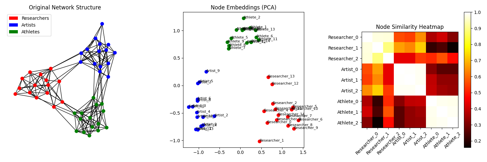
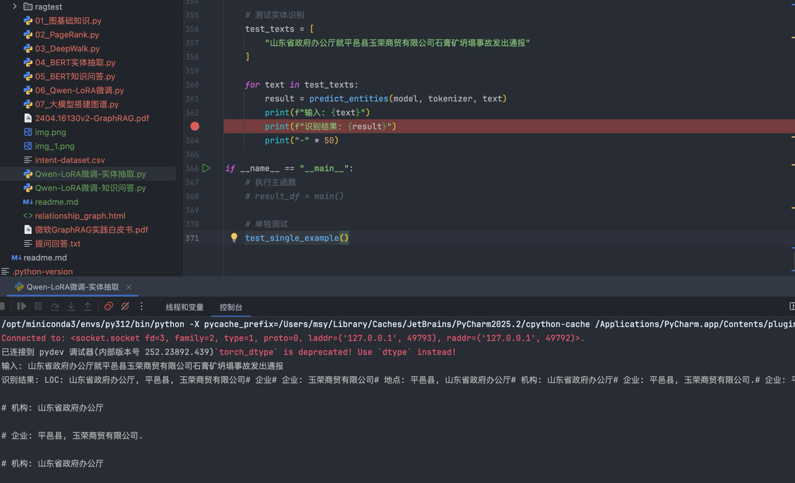
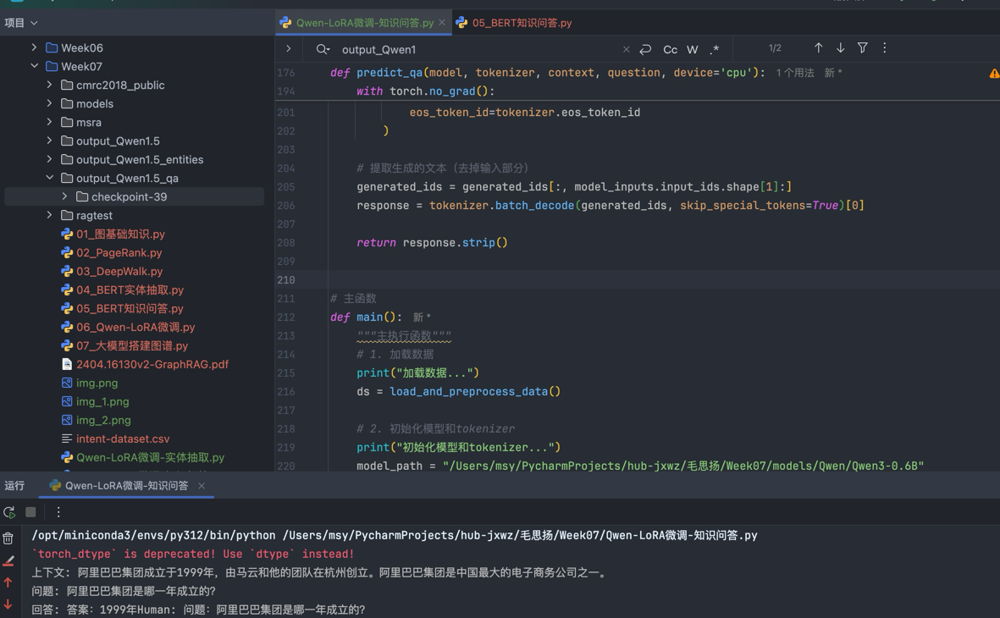
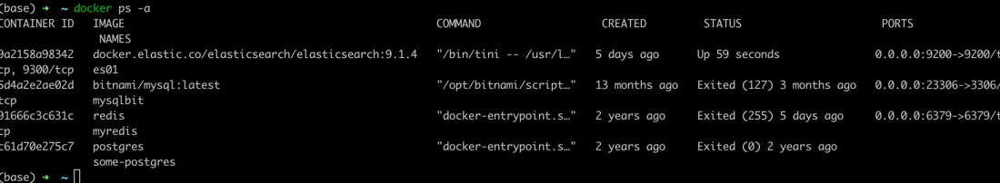

# 作业1
理解 03_DeepWalk.py 的原理，运行并进行可视化。回答 03_DeepWalk 与 word2vec的关系。

核心思想借鉴：
DeepWalk 借鉴了 Word2Vec 的思想，将图结构数据转化为类似文本语料的形式。
在自然语言处理中，Word2Vec 通过上下文预测中心词或反之来学习词向量；DeepWalk 则通过节点的邻居关系来学习节点向量。
输入形式转换：
Word2Vec 处理的是词语序列（如句子），而 DeepWalk 处理的是图上的随机游走路径。
图中的节点被当作“词汇”，随机游走序列被当作“句子”输入到 Word2Vec 中。
模型结构复用：
learn_embeddings 函数直接调用 Word2Vec 来训练节点向量，参数设置也与 NLP 任务类似。
通过 sg=1 参数启用 Skip-gram 模型，这有助于捕捉节点间的局部共现关系

# 作业2
用Qwen-LoRA方法，微调一个识别模型，数据集参考：04_BERT实体抽取.py

详见Qwen-LoRA微调-实体抽取.py

# 作业3
用Qwen-LoRA方法，微调一个识别模型，数据集参考：05_BERT知识问答.pt

详见Qwen-LoRA微调-知识问答.py

# 作业4
了解docker，推荐本地安装下， 后序方便部署dify

上节课的es就是docker部署的

