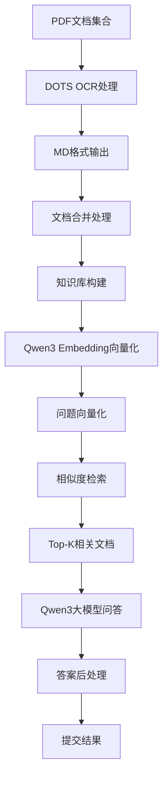
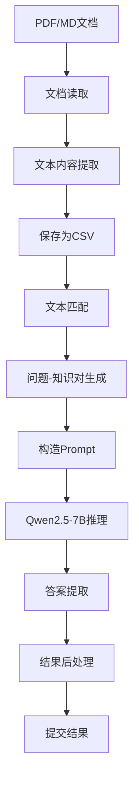
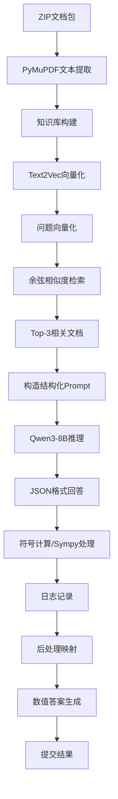

# 作业1:

理解文档公式解析与智能问答中的思路1，阅读待选方案1、2、3

实施步骤：

- 步骤1：pdf公式的解析，将文档中的公式进行结构解析，并生成对应的$\LaTeX$公式。
- 步骤2: RAG的检索和排序，用户的提问 与 公式 进行相似度计算，也可以加入rerank 过程，选择得到top1-8待选公式。
- 步骤3:
    - 使用qwen-3 thinking模型，输入用户提问 + 公式latex ，生成对应的代码 或 sympy ，并执行代码，返回结果。
    - 使用qwen-3 thinking模型，直接推理得到答案。

    
## 方案1：基于OCR和RAG的问答系统

### 实现原理

方案1采用了OCR技术结合RAG问答系统的方式。具体来说：

1. **文档处理阶段**：
   - 使用dots.ocr VLM模型将PDF文档转换为Markdown格式
   - 对分页的MD文档进行合并处理，形成完整的文档内容

2. **问答处理阶段**：
   - 使用Qwen3 embedding模型进行向量化检索
   - 采用Qwen3大模型（32B/235B规格）进行问答生成
   - 对于无法回答或预测错误的问题，采用默认值策略（如返回常数值10）

3. **优化策略**：
   - 针对badcase进行了专门处理，如单位换算问题（万元转元）
   - 对大模型prompt进行优化以减少错误回答
   - 调整召回策略，考虑对问题进行分类标签化以提高准确率

### 流程图

## 方案2：基于文本匹配的问答系统

### 实现原理

方案2采用较为直接的方法，通过文本匹配建立问题与知识的对应关系：

1. **文档处理阶段**：
   - 使用PyPDFLoader等工具读取PDF/MD文档内容
   - 将文档内容保存为CSV格式

2. **匹配阶段**：
   - 通过文本匹配算法，为每个问题找到最相关的背景知识
   - 生成matched.csv文件，包含问题与相关知识的对应关系

3. **问答处理阶段**：
   - 加载本地Qwen2.5-7B模型
   - 构造prompt，要求模型只回答数字或估计值
   - 处理单位转换问题（如"万元"转换为阿拉伯数字）

### 流程图

## 方案3：基于检索增强生成(RAG)的完整解决方案

### 实现原理

方案3是一个完整的两阶段RAG解决方案：

1. **第一阶段：文档解析与检索**
   - 使用PyMuPDF提取PDF/MD文档的纯文本内容
   - 利用sentence-transformers库的text2vec模型进行向量化
   - 对问题进行向量化并通过余弦相似度检索Top-3相关文档

2. **第二阶段：LLM推理与后处理**
   - 使用Ollama部署Qwen3-8B模型进行推理
   - 设计精心构造的Prompt引导模型输出结构化JSON格式回答
   - 包含意图识别（数值计算、公式检索、结论推导）和符号计算
   - 通过后处理脚本将各种形式的答案统一转换为数值格式

### 流程图

## 总结

这三种方案各有特点：

- **方案1**注重OCR处理和大模型能力，适合处理公式密集型文档
- **方案2**采用直接文本匹配方法，实现简单但可能精度有限
- **方案3**是最完整的RAG解决方案，具有良好的结构化处理能力和后处理机制，能够应对多种类型的问答需求

方案3在设计上最为完善，包含了完整的检索、推理和后处理流程，并且针对不同类型的问答任务都有相应的处理策略。

# 作业2:

解析10个pdf文档，并定义10个对应的mcp tool，可以通过numpy 计算，也可以通过sympy计算。

# 作业3:

结合rag tool筛选 加 mcp tool执行完成 整个问答。

- 步骤2: 定义mcp服务，并且将每一个公式整理为mcp 的一个可执行的tool 或 sympy的计算过程。
- 步骤3: 得到用户提问的时候，需要选择对应的tool
    - 通过rag的步骤（用户的提问 与 公式 进行相似度计算，也可以加入rerank 过程，筛选top1/3公式） -》 tool 白名单
- 步骤4: 调用对应的tool，执行，得到结果，汇总得到回答。