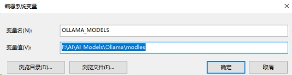
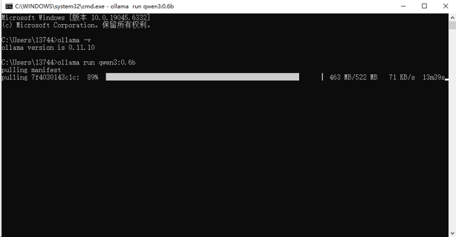
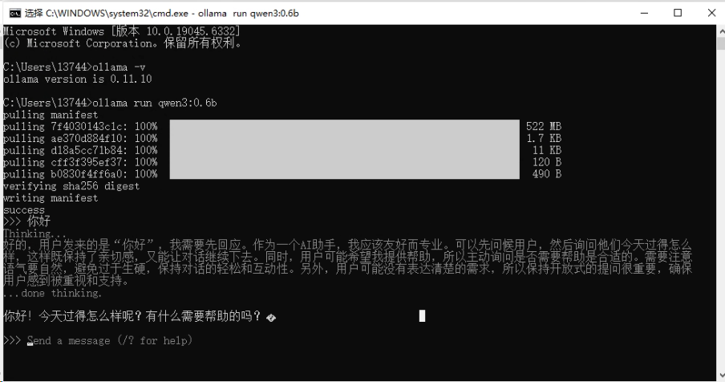

1、进入官网

[qwen3:0.6b](https://ollama.com/library/qwen3:0.6b)

2、点击下载选择系统为windos

4、win+r 输入 cmd，在命令行窗口输如 ollama -v 出现版本号

3、点击左上角Modles

4、找到qwen并且点击进去,在列表中找到qwen3:0.6b

5、设置环境变量 更改模型安装位置



6、在cmd窗口中输入 ollama run qwen3:0.6b 开始下载





ollama 常用命令

```
Usage:
  ollama [flags]
  ollama [command]

Available Commands:
  serve       启动 ollama 服务
  create      从 Modelfile 创建一个模型
  show        显示一个模型的详细信息
  run         运行一个模型
  stop        停止一个正在运行的模型
  pull        从注册中心拉取一个模型
  push        向注册中心推送一个模型
  list        列出本地已有的模型
  ps          列出正在运行中的模型
  cp          复制一个模型
  rm          删除一个模型
  help        显示帮助信息

Flags:
  -h, --help      获取 ollama 的帮助信息
  -v, --version   显示 ollama 的版本信息

```

