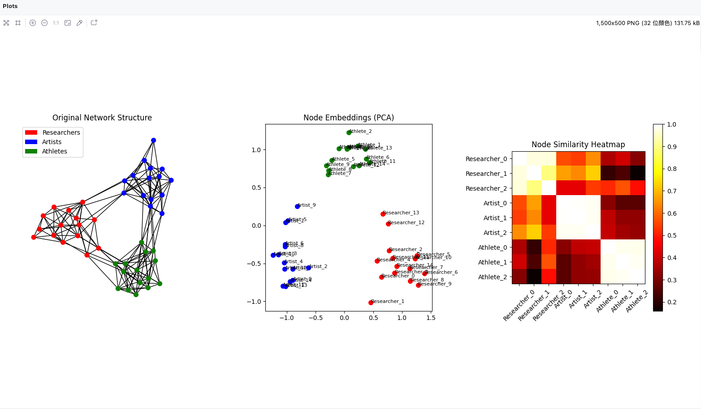

### 03_DeepWalk.py 运行可视化结果

### DeepWalk 与 word2vec 的关系
- DeepWalk 是一种利用 word2vec 进行图表示学习的算法
- DeepWalk 目标是将图数据转换成向量
- word2vec 需要的是序列的数据
- DeepWalk 通过随机游走算法生成符合 word2vec 要求的序列数据，通过 word2vec 实现图结构数据到向量的转换