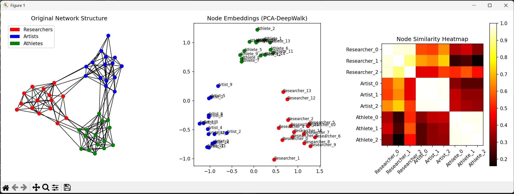
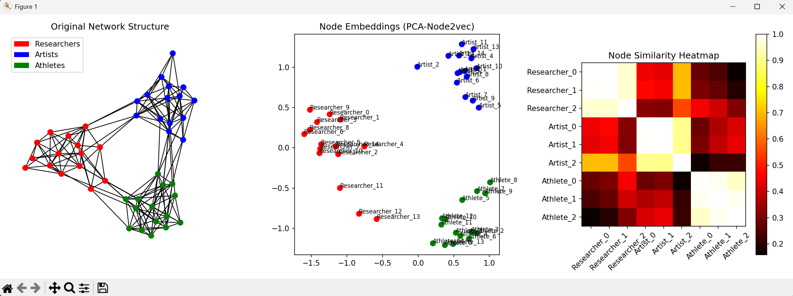

# DeepWalk 算法分析与可视化

## 基本原理

DeepWalk是一种将图节点映射到向量空间的算法，其核心思想借鉴了自然语言处理中的Word2Vec技术。算法主要包含以下几个步骤：

1. **图构建**：创建一个包含三个社交圈子的图结构（研究人员、艺术家和运动员）
   - 每个圈子内部有较高的连接概率（40%-60%）
   - 圈子之间有较少的跨圈子连接（20%-30%）

2. **随机游走生成**：
   - 从每个节点出发，进行固定长度的随机游走
   - 生成大量节点序列，模拟自然语言中的句子

3. **Word2Vec嵌入学习**：
   - 使用Skip-gram模型学习节点表示
   - 将节点视为"单词"，游走序列视为"句子"
   - 通过神经网络学习节点的低维向量表示

4. **相似度计算与可视化**：
   - 计算节点向量的余弦相似度
   - 使用PCA降维展示节点在二维空间的分布
   - 生成热力图展示节点间相似度关系

## DeepWalk与Word2Vec的关系

DeepWalk与Word2Vec之间存在紧密的关系：

1. **算法借鉴**：DeepWalk直接借鉴了Word2Vec的Skip-gram模型架构
2. **概念映射**：
   - 图中的节点 ⇨ 文本中的单词
   - 随机游走序列 ⇨ 文本中的句子
   - 节点共现关系 ⇨ 单词上下文关系
3. **核心思想**：都是通过上下文预测来学习分布式表示
4. **技术实现**：DeepWalk直接使用Word2Vec库来学习节点嵌入

这种关系使得DeepWalk能够利用Word2Vec在自然语言处理中的成功经验，将图结构数据转换为向量表示，从而应用各种机器学习算法。

## 可视化结果

## 运行结果分析

从可视化结果可以看出：

1. **原始网络结构**：三个社交圈子（红、蓝、绿）清晰可见，圈子内部连接密集，圈子之间连接稀疏

2. **节点嵌入投影**：
   - 同一圈子的节点在向量空间中聚集在一起
   - 不同圈子的节点形成了明显的聚类
   - 跨圈子连接的节点在向量空间中也更接近

3. **相似度热力图**：
   - 对角线上的节点自身相似度为1（最亮）
   - 同一圈子内的节点相似度较高
   - 不同圈子间的节点相似度较低

这些结果表明DeepWalk成功捕捉了图的结构信息，将拓扑相似的节点映射到向量空间中相近的位置。

## 总结

DeepWalk通过结合随机游走和Word2Vec技术，有效地学习了图中节点的低维向量表示。这种方法不仅保留了图的结构信息，还为后续的图分析任务（如节点分类、链接预测等）提供了便利的数值特征。DeepWalk与Word2Vec的紧密关系体现了跨领域方法迁移的成功案例。
## 对比Node2Vec的比对图（p<1,q>1）

